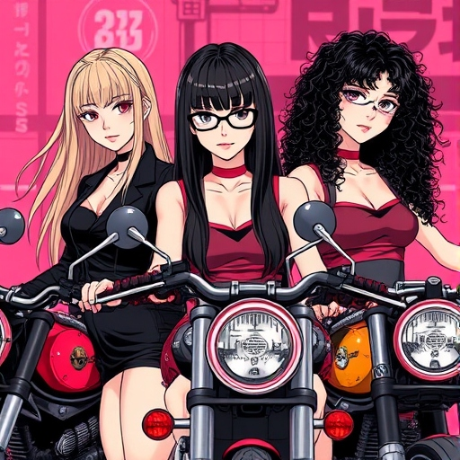

<h1 align="center">PuchiBeruta</h1>

<strong>In this second release,</strong> we have extended the functionalities of our game engine, <strong>PuchiBeruta</strong>, by integrating a full scene editor and several essential optimisations. This engine is developed using the SDL2, OpenGL, Assimp, DevIL, ImGui and Cereal libraries. In this phase, we have implemented all the features required in the first and second releases, including:

- <strong>Scene editor:</strong> tools to manage GameObjects with hierarchies, transformations (translate, rotate, scale), mesh and texture mapping, and camera setup.
- <strong>In-world selection:</strong> GameObjects can be selected directly in the scene using the mouse.
- <strong>Frustum Culling:</strong> with real-time visualisation for improved performance and debugging.
- <strong>Resource management:</strong> a system that automatically organises assets, saves meshes and textures in a custom format, and ensures efficient use of memory.
- <strong>Scene serialisation:</strong> to save and load complete configurations.
- <strong>Controlled simulation:</strong> options to smoothly start, pause and stop the simulation.

#### Github link: https://github.com/CITM-UPC/puchiBeruta_CRM

 

---

### TEAM MEMBERS
- **Maria Perarnau**: [MariaPerarnau](https://github.com/MariaPerarnau)
- **Rebeca Fernández**: [Becca203](https://github.com/Becca203)
- **Carla Puga**: [cpugaper](https://github.com/cpugaper)

<h1 align="center"></h1>

---

### CONTROLS

#### Select scene to allow control of the camera

- Move around the scene: Hold right click + "WASD".
- Zoom in & zoom out: Scroll mouse wheel.
- Orbit the object: Alt + right click.
- Centre camera on the game object: Select desired object + Press F.
- Duplicate camera speed: Hold down SHIFT.
  
 

- Select object: Left click.
- Delete object: Select object + delete (Supr Key).
- Selecting many objects at once: CTRL + left click.
- Making an object a parent: Select the objects to be grouped + Press P with the parent object selected last.
- Unparent: Select parent object + Press P.

 

---

### ADDITIONAL FEATURE

- Docking (saved from your last configuration for the next execution)
- Modify the name of objects from the configuration tab in the inspector
- Application icon
- Icon for each type of asset
- "Window Theme" option for changing the colour of UI objects in the engine configuration
- Objects can be activated (shown on screen) or disactivated (hide) by clicking the checkbox next to their name in the inspector
- Objects can be dynamic (will move on running simulation) or not (won't move) by clicking the checkbox "is Dynimac" in the inspector

 
